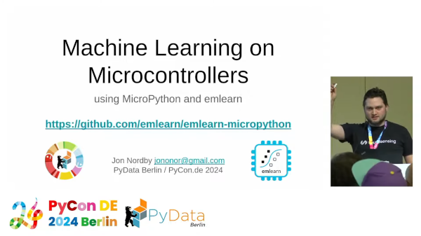

# PyData Berlin 2024

Program: https://pretalx.com/pyconde-pydata-2024/talk/NYHFSB/

## Machine Learning on microcontrollers using MicroPython and emlearn

A presentation on deploying ML models to microcontrollers using
[emlearn](https://github.com/emlearn/emlearn),
[MicroPython](https://micropython.org),
and [emlearn-micropython](https://github.com/emlearn/emlearn-micropython).

- [Slides](./emlearn-micropython-PyDataBerlin2024.pptx)
- [Proposal](./proposal.md)
- [Notes](./notes.md)

#### Recording

Video recording. [Youtube](https://www.youtube.com/watch?v=S3GjLr0ZIE0).

