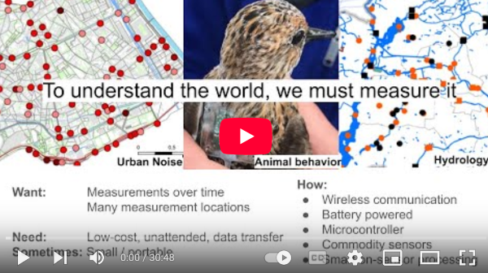

# Sensor data processing on microcontrollers with MicroPython
With focus on scientific applications.

#### Video recording

[Video (YouTube)](https://www.youtube.com/watch?v=VmVQu9cygMI)

#### Slides
[.PPTX](<EuroSciPy 2025 - Sensor data processing on microcontrollers with MicroPython.pptx>)
| [.PDF](<EuroSciPy 2025 - Sensor data processing on microcontrollers with MicroPython.pdf>)

#### Notes
[Notes](./notes.md) | [Proposal](./proposal.md)

## Abstract
Being able to sense physical phenomena is critical to many areas of science;
from detecting particles in physics, to measuring pollution in public health, to monitoring bio-diversity in ecology.
Over the last decades, the capabilities and costs of sensor system has become much better,
driven by improvements in microprocessors, MEMS sensor technology, and low-energy wireless communication.
Thanks to this, Wireless Sensor Networks and "Internet of Things" (IoT) sensor systems are becoming common.

Typically sensor nodes use microcontroller-based hardware, and the firmware developed primarily using C (or C++).
However, it is now becoming feasible to write microcontroller firmware using Python.
This is thanks to the MicroPython project, combined with affordable and powerful hardware from the last couple of years.
Using the familiar and high-level Python programming language makes the process of creating sensor nodes more accessible to an engineer or scientist.

In this talk, we will discuss developing microcontroller-based sensors using MicroPython.
This includes a brief introduction to MicroPython, how to do efficient data processing, and share our experience applying
this to process accelerometer and microphone data, using both Digital Signal Processing and Machine Learning techniques.

