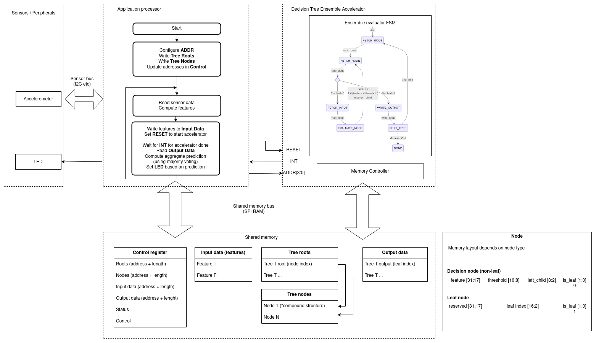

# Design

## Decision tree ensembles


## System architecture



## Operating principle

Acts as an accelerator/co-processor for a CPU, with communication happening via RAM.
Conceptually this would be on the CPU memory bus.
For the initial development, an external (SPI) RAM will be used,
which may be accessed via a SPI peripheral instead of being memory-mapped.

The CPU configures the peripheral via RAM.
Both defining the model (forest of decision trees), providing the input (features), reading the output.

Puts in data in RAM, triggers the RF engine, waits for completion, reads out result from RAM. Uses/checks the result.

The accelerator also has a CLOCK pin, and a RESET pin.
Possibly also a RUN pin, and a INT pin for signalling.

# Scope
For version 1. Random Forest multi-class classification.

- Support multiple trees, executing all in one run.
- Outputs the predictions of all trees separately (leaf indices). Aggregation done on CPU side
- Can be used with SPI RAM connected to board
- Works with a standard microcontroller, like RP2040
- Addresses of all data specified via control register in RAM
- Sequential execution. No pipelining or parallell execution
- Blocking reads from RAM. No caches etc

#### Not sure

- Can be used with QSPI RAM provided by PMOD. 8 MB ?
Maybe QSPI should actually be later...
Just plain SPI, 16 bit addresses for now?

#### Stretch

- Match or exceed performance of CPU-based decision tree evaluation. At least that of a TinyTapeout CPU.
- Works with a TinyTape microcontroller. Like tt06 tinyQV

#### Non goals / out of scope
At least for version 1.

- Output aggregated prediction of entire forest. Argmax or proba.
- Pipelining or other perf tricks to reduce impact of slow I/O
- Parallel execution of trees

## Requirements

- Multi-class. Minimum 8 classes
- 8 bit integer features and thresholds. Signed?
- Minimum 8 features. Ideally 32-64
- Minimum 4 trees. Ideally 10.
- Configuration via "memory mapped" peripheral
- Support peripheral base address via pins.
- Data addresses. Minimum 23 bit (8 MB address range)
- Set SPI pins as inouts when in reset/disable!
Important to allow others to write/read from SRAM.


## Peripheral control register

- Status. 1 byte?
- Output address. 3 bytes
- Input address. 3 bytes
- Roots address. 3 bytes
- Nodes address. 3 bytes
- Number of nodes. 2 bytes
- Number of inputs/features. 1 byte
- Number of trees/roots. 1 byte

## Address of peripheral control register

Decided by input pins.


## RAM requirements

Example design constraints

- 8 bit features
- 10 trees.
- 64 features
- 1000 decison nodes total
- 256 leaf max

RAM requirements minimum

- Status: 1-8 bytes?
- Out (leaf indices): 1 per tree. 10 bytes
- Input. 1 per feature. 64 bytes
- Nodes. 7 bits feature, 1 bit leaf, 8 bits threshold, 8 bits next - 3 bytes.
Could be smaller, but then not byte aligned anymore. 3000 bytes for 1k nodes.

Space is sominated by decision nodes.
Can do quite a lot with 4 kB!
Even 512bytes-2kB could be used. But also as large as 32kB, for 10k nodes.

The external RAM options are 64 kB (SPI RAM emulated on RP2040), or 8 MB (QSPI PSRAM).
Way larger than this. Good!


## TODO 

#### PoC accelerator implemented in C

Two microcontroller CPUs connected to shared external QSPI PSRAM.
Controlling/test CPU. RP2040, running MicroPython.
Accelerator CPU. RP2040, running C.

Implement the accelerator in C.
Write test programs in MicroPython.
Those can be carried forward to FPGA and ASIC implementation.

Using the QSPI PMOD for communication.
https://store.tinytapeout.com/products/QSPI-Pmod-p716541602

Ordering

- QSPI PMOD. Done, January
- Pico-ice. 2x or 3x
- 2-3x https://no.mouser.com/ProductDetail/Digilent/410-135?qs=s%2FdyVPQMB4x84ELO7yakDg%3D%3D
- 2-3x https://no.mouser.com/ProductDetail/Digilent/240-110?qs=AQlKX63v8RsQhpXXNV1xkA%3D%3D

Ref proto.c


#### Implementing in FPGA

- Setup Verilog toolchain, including test bench execution 
- Be able to read values from RAM, modify and write to another RAM location 

Decision step

- Define RAM structure for features and nodes, and some output location
- Read a node, the feature value, write output based on if it was higher or lower

Decision tree

- Same base as decision step. But instead take new node value and use it to read next node. Iterate until node is a leaf. Write leaf index as output

Physical verification 

- Order an FPGA for real tests. ICE40 board. pico ice?
- Run on FPGA 


#### Use as co-accelerator for TinyTape CPU


Tech demo/test

- Get a hold of a TTO CPU
- Get it to run code
- Create a demo that uses the RF accelerator to classify data 

Application demo

- Read sensor int CPU accelerometer
- Perform feature extraction on CPU
- Pass features to RF accelerator to classify
- Do something fun with the output


# Implementation

## Memory controller

Two main options. SPI with RP2040. Or QSPI, with dedicated PMOD

## Decision tree evaluator

Probably using a Finite State Machine.
Needs to handle read and writes from external RAM.
Do the evaluation logic.


# Background


## Interoperating with CPUs from TinyTapeout

Several available that use external SPI/QSPI memory, and have basic GPIO.
That hopefully one could write a program on the CPU
which uses the accelerator here to run the decision tree ensemble.
So far the RISC-V cpus seem most relevant.
Mostly because they have a standard C programming toolchain.


### tt09 ITS-RISCV

https://tinytapeout.com/runs/tt09/tt_um_underserved
https://github.com/BambangTW/tt09-ITS-RISCV


### tt07 underserved

https://github.com/olofk/underserved
Underserved only implements 4 GPR registers
RISC-V SoC that fits into two TinyTapeout.
Based on SERV, and a GPIO controller, and XIP memory controller using external SPI memory.

### tt08 HACK CPU

https://tinytapeout.com/runs/tt08/tt_um_hack_cpu

16-bit CPU based on the HACK architecture.
Uses SPI external memory.
Said to work with the RP2040 emulated memory.

https://en.wikipedia.org/wiki/Hack_computer

### tt06 FazyRV-ExoTiny

https://github.com/meiniKi/FazyRV-ExoTiny
https://github.com/meiniKi/fazyrv

Implements a RISC-V CPU.

Uses external memory over QSPI (RAM and ROM).

### tt07 LISA

https://tinytapeout.com/runs/tt07/tt_um_lisa

https://github.com/kdp1965/tt07-um-lisa-ttlc
8 bit microcontroller.
Custom ISA.

External memory via (Q)SPI. Switchable mode.
Uses a custom PMOD for QSPI?

Has a 1 kbit data cache, using a DFFRAM macro.

Takes a total of 2x6 tiles on TinyTapeout.

#### tt05 

https://github.com/cpldcpu/tinytapeout_mcpu5

Total cell count after synthesis is 489.
Fits into 1 tile, and 100x100 um.

### tt06 tinyQV

By Mike Bell.

https://github.com/MichaelBell/tinyQV/
https://github.com/MichaelBell/tt06-tinyQV/

Uses a PMOD with SPI Flash and two PSRAMs.
https://github.com/mole99/qspi-pmod
Seems to have 23 bits addresses for the RAM?

! use this pinout and PMOD for the RAM?

tinyQV Has documented address map

```
0x0000000 - 0x0FFFFFF: Flash (CS0)
0x1000000 - 0x17FFFFF: RAM A (CS1)
0x1800000 - 0x1FFFFFF: RAM B (CS2)
0x8000000 - 0x80007FF: Peripheral registers (see TT06 repo)
```

PSRAM to in QSPI mode.

Did testing on Pico-Ice.
https://pico-ice.tinyvision.ai/
Uses MicroPython (on the RP2040, presumably), to load program into the QSPI, and then starting the FPGA (with the CPU core, presumably).
 
https://github.com/MichaelBell/tinyQV/blob/main/pico_ice/micropython/run_tinyqv.py

Sets up the external RAM and FLASH, over QSPI.
Seems to use RP2040 also to run the clock?
Pulls the reset and waits for a DONE pin.
Does not seem to use RAM much?

Here is code for testing read/write to RAM, from RP2040.
https://github.com/MichaelBell/tinyQV/blob/main/pico_ice/micropython/test_psram.py

Has code for an external SPI peripheral.
https://github.com/MichaelBell/tinyQV/blob/main/peri/spi/spi.v
But the code used for QSPI RAM/FLASH seems to be
https://github.com/MichaelBell/tinyQV/blob/main/cpu/qspi_ctrl.v

! no TT06 development board in the store? Only ASIC kit... :(

Can run at 64 Mhz.
Can do 1 instruction per 4/8 cycles.

! should be able to run at 64 Mhz (or more)

Uses a Python-based testing tool, https://www.cocotb.org/

cocotb is an open source coroutine-based cosimulation testbench environment
for verifying VHDL and SystemVerilog RTL using Python. 


### tt07 KianV RISC-V RV32E

https://github.com/splinedrive/RISCV-KianV-BareMetalStyle/blob/main/docs/info.md

Uses PMOD Flash + PSRAM.

Use 8MB of PSRAM address.

As of Jan 2025, very sparse documentation.

### TT05 KianV-RV32IMA-RISC-V-uLinux-SoC


https://tinytapeout.com/runs/tt05/tt_um_kianV_rv32ima_uLinux_SoC
https://github.com/splinedrive/KianV-RV32IMA-RISC-V-uLinux-SoC
https://github.com/splinedrive/kianRiscV

Defines an address map. PSRAM mapped at 0x8000000

16 MiB of external SPI flash memory, 8 MiB of external PSRAM


## RAM options

### SPI RAM

SPI RAM externally is provided on the standard TinyTapeout test setup.
By RPi Pico RP2040, with emulated SPI RAM.
https://tinytapeout.com/specs/memory/
64 kB maximum.


> RP2040 emulated RAM is currently limited to 1-bit, single data rate SPI at a max of about 20MHz 
RebelMike 11/7/24, 7:16 PM

https://github.com/MichaelBell/spi-ram-controller
Verilog code for an SPI controller.
Tested with the RP2040 SPI RAM emulator. 

Accessing SPI RAM from RP2040.
Should be easy, using the standard SPI peripheral of RP2040.


### QSPI PSRAM

8 MB PSRAM PMOD. Used by several RISC-V CPUs on TinyTapeout.
https://github.com/mole99/qspi-pmod
Provides SPI Flash and two PSRAMs.
Is in TinyTapeout store.
https://store.tinytapeout.com/products/QSPI-Pmod-p716541602

Accessing external PSRAM from RP2040

- Standard SPI commands should work? At least for not-so-fast clocks, and single SPI?
- QSPI require using PIO.
- https://github.com/MichaelBell/tinyQV/blob/main/pico_ice/micropython/run_tinyqv.py has a qspi_read - but no qspi_write...
- tjaekel implemented QSPI with PIO. MicroPython code at https://forums.raspberrypi.com/viewtopic.php?t=376964
- 4 bit sdcard SDIO with PIO. Should be adaptable to QSPI, in theory.
https://github.com/raspberrypi/pico-extras/blob/master/src/rp2_common/pico_sd_card/sd_card.pio
- SPI only, but high frequency. https://github.com/polpo/rp2040-psram

### On-chip RAM for FPGA

FPGA chips often provides SRAM blocks.
ICE40 ERB has 4Kbit/512byte, between 8 and 32 of them, depending on device.
And Ultraplus has 256Kbit/8kB blocks, 4x of them.

### On-chip RAM for TinyTapeout

Ref https://tinytapeout.com/specs/memory/
Generally limited to quite small amounts.
Can fit around 320 DFFs (40 bytes of memory) in a single tile.

Some existing designs.

- [urish tt06-256-bits-dff-mem](https://github.com/TinyTapeout/tt06-256-bits-dff-mem).
264 DFFs (32 bytes of memory + 8 bits for the output register), and utilizes 70% of the tile area
- [MichaelBell/tt06-memory/](https://github.com/MichaelBell/tt06-memory/).
64 byte RAM implemented using 512 latches.
Uses 88% of a single tile area.
- RAM32 macro.
128 bytes arranged as 32x32 bits (32 words of 32 bits each) with a single read/write port (1RW).
Uses an area of 401 x 136 um, which fits in 3x2 tiles and uses about 54% of the area.


## Performance considerations

Arithmetic intensity is a key metric to consider when designing hardware accelerators.
The number of arithmetic operations with relation to the number of memory operations.

Decision trees have a very low arithmetic intensity.
This means that the expected speedup over a standard microcontroller is generally expected to be low.
Furthermore, when using an external memory (which is slow), the performance can be expected to be rather bad,
as it will be dominated by I/O time.

For each decision node to evaluate, there is only 1 arithmetic operation (a comparison).
Assuming 32 bits per node, and 8 bit per feature.
We need to do at least 1 32 bit fetch and 1 8 bit fetch.
Potentially 4x8 bit fetches if our memory bus is 8-bit.
Arithmetic intensity of 0.5 (per fetch) to 0.20 (per byte).

The input data is one piece of memory that is continiously accessed.
Having that in an on-chip memory would be advantageous.
And it may be acceptable to limit the size to an amount which is practically realizable in TinyTapeout.
Dedicating 1 tile to memory might give between 32-64 bytes,
which still makes for a practical.

There is some locality in the node.
So having prefetching of the (potential) next node(s) should be advantageous.

Increasing the arithmetic intensity by integrating more computation into each decision node could be another strategy.
This would be a non-standard decision tree, and likely also require R&D on which transformations to support,
as well as a learning algorithm that can build such trees.
There is some prior art in this area. Including Bonsai by Kumar et al.

Is it possible to arithmetic intensity somewhat by
having N-deep subtrees as the primary operator (instead of single binary decision nodes)?
The input and output data needs are conceptually the same (feature indices, feature thresholds, leaf indices),
so it does not immediately seem so?
But doing larger fetches with larger values might be somewhat beneficial?
But this might as well be a cache prefetch mechanism only.

Gradient Boosted Trees frequently use shallow trees only.
Typically 3-8 levels.
If the potential output _values_ would be restricted to a small set.
Might only work well for binary or few-class classification.
Seems that reducing the number inputs (features) and outputs,
is the only way to really reduce the size of the nodes.
By setting fixed sizes for these, might be able to. At cost of flexibility.


# Findings

ChatGPT **seems** to be decently at generating example Verilog code?


# Implementation

#### Pinouts

How to trigger start? Via IO pins or SRAM?
TRIG pin low?

How to signal completion? Via IO pins or SRAM
INT pin low? Status in SRAM?

#### RAM access

How to read/write SPI SRAM? In Verilog, compatible with TinyTapout

#### Forest
Need to define decision node format in-memory.

#### Probability aggregation
Need to do a streaming mean operation.
Need to define storage for leaf nodes.

#### Argmax aggregation

Need to pick largest of N numbers.
Proba values minimum 4 bits. Maybe 8?


## Next step: Feature extraction

Dream design is to have an ASIC with complete ML inference capabitilies.
From sensor input to classification output.
Possibly having a simple CPU for coordination,
but main part of data flow being done with accelerated blocks.

Would like to try to build this out incrementally.
Create more and more accelerated blocks.
Reduce how much is done by CPU.

For that would want to move [feature extraction to an accelerator](./feature_extraction.md).


## Open questions


How to be a useful building block for later?
Bot for oneself - building towards a complete TinyML ASIC flow.
But also for others? Allowing reuse.
Relevant interop type projects.


#### What other projects exist that could be relevant to interoperate with?

- Input data. ADC, digital peripherals/protocols
- Feature extraction/processing blocks. IIR, FIR, FFT
- CPUs. RISC-V etc

#### Are there existing projects that put/read data from RAM?
Others than the CPUs?

#### Could we interoperate (via RAM) with one of the microcontrollers?
Typ RISC-V.
Theoretically this seems feasible?!
But have not seen any examples of that yet.

#### How to act nice with a shared SPI RAM?

Input pins that specify the start address?
8 input only pins. Allows 256 options.
If 64 kB range, allows specifying down to 256 byte location.
Would probably want to block off the memory region used in firmware program, say using a linker script.


## References

### Related works

#### FPGA Accelerator for Gradient Boosting Decision Trees
https://www.mdpi.com/2079-9292/10/3/314

> Compared to a high-performance processor running optimized software, on average our design is twice as fast and consumes 72 times less energy.
> Compared to an embedded processor, it is 30 times faster and consumes 23 times less energy.

Using 32 bits per node.
Uses different data representations for leaf and non-leaf nodes. Ref Figure 3.

Decision node: 8 bits feature index. 16 bit threshold. 7 bit relative jump for right, 1 bit is_leaf.

Leaf node: 16 bit leaf value. 14 bits next tree + 1 bit is_last_tree

Pointer to next tree is alternative to storing roots? Disadvantage: forces serial execution.
But that is inherent in Gradient Boosted Trees, since leaf values are added.

Discusses pipelined execution, both single thread and multi-thread.
Provides a class diagram of the accelerator. Ref Figure 5.

#### Scalable inference of decision tree ensembles: Flexible design for CPU-FPGA platforms
https://ieeexplore.ieee.org/document/8056784
https://readingxtra.github.io/docs/ml-fpga/scalable-inference-fpga.pdf

> Different trees in an ensemble can be processed in parallel during tree inference, making them a suitable use case for FPGAs.
> Large tree ensembles, however, require careful mapping of trees to on-chip memory and management of memory accesses
> As a result, existing FPGA solutions suffer from the inability to scale beyond tens of trees and lack the flexibility to support different tree ensembles
> In this paper we present an FPGA tree ensemble classifier together with a software driver to efficiently manage the FPGA's memory resources.
> The classifier architecture efficiently utilizes the FPGA's resources to fit half a million tree nodes in on-chip memory,
> delivering up to 20× speedup over a 10-threaded CPU implementation when fully processing the tree ensemble on the FPGA.

#### Decision Tree Ensemble Hardware Accelerators for Embedded Applications
Rastislav Struharik
2015

? no PDF available =//

https://www.researchgate.net/publication/283910062_Decision_Tree_Ensemble_Hardware_Accelerators_for_Embedded_Applications

https://www.semanticscholar.org/paper/Decision-tree-ensemble-hardware-accelerators-for-Struharik/db90e2c322d648ce3468e51bdea05db408c5c549?sort=relevance&page=2
has the figures

Follow up to 2011 paper?

#### Implementing Decision Trees in Hardware
J.R. Struharik
2011

- Single Module per Level (SMpL) Architecture
- Universal Node (UN) Architecture.

References two existing implementations.

Tested on Xilinx 2. Compared execution speed of MicroBlaze soft CPU with the proposed hardware FPGA implementations.
Report speedups betweem 9x and 900x.
Pipelining was critical to the high execution speeds.
Number of "slices" used ranged from 100 to 10k.


#### conifer
https://github.com/thesps/conifer

Conifer translates trained Boosted Decision Trees to FPGA firmware for extreme low latency inference.

Has conversion code from scikit-learn etc.


#### hls4ml

hls4ml is a Python package for machine learning inference in FPGAs
https://fastmachinelearning.org/hls4ml/


#### Efficient Majority Voting in Digital Hardware
Stefan Baumgartner, Mario Huemer, Michael Lunglmayr

2021

https://arxiv.org/abs/2108.03979
https://arxiv.org/pdf/2108.03979

#### Fast and Energy-Efficient Oblique Decision Tree Implementation with Potential Error Detection

https://www.mdpi.com/2079-9292/13/2/410

! Good description of baseline DT architecture.
Figure 1 has simple diagram of base Decision Tree.

a control module (CTL), a node memory, an input memory, and a computation module (COMP)


> The proposed approach begins by identifying an input vector that might be classified differently by a fixed-point decision tree than by a floating-point decision tree.
> Upon identification, an error flag is activated, signaling a potential misclassification.
> This flag serves to bypass or disable the subsequent classification procedures for the identified input vector, thereby conserving energy and reducing classification latency. 
> Subsequently, the input vector is alternatively classified based on class probabilities gathered during the training phase.
> In comparison with traditional fixed-point implementations, our proposed approach is proven to be 23.9% faster in terms of classification speed,
> consuming 11.5% less energy without compromising classification accuracy.


#### Co-Processor for evolutionary full decision tree induction
https://www.sciencedirect.com/science/article/abs/pii/S0141933116300497

Implemented using FPGA.

> Substantial DT induction time speedups for the selected benchmark datasets
> from the standard UCI machine learning repository database.

#### Efficient traversal of decision tree ensembles with FPGAs
https://www.sciencedirect.com/science/article/abs/pii/S0743731521000915
https://arts.units.it/bitstream/11368/3034418/5/1-s2.0-S0743731521000915-main-Post_print.pdf

> Present three SoC architecture designs for speeding-up inference tasks based on machine learned ensembles of decision trees. 
> QuickScorer, the state-of-the-art algorithm for the efficient traversal of tree ensembles

Paper has nice diagram of the data layout.

#### TreeLUT: An Efficient Alternative to Deep Neural Networks for Inference Acceleration Using Gradient Boosted Decision Trees
https://arxiv.org/html/2501.01511v1

> Perfect Fit for FPGAs: GBDTs mostly consists of decision trees, which resemble binary decision diagrams (BDDs).
> These BDD-like structures nicely map to LUTs, as FPGA design flows are highly optimized to implement such structures efficiently
> Moreover, these models perform simple operations during inference, which makes their hardware implementations more efficient.


> For the hardware architecture, it uses a fully unrolled 3-layer architecture, making it modular, scalable, and efficient in terms of hardware costs
> Finally, it inserts pipelining stages in the architecture to achieve lower latency and higher throughput, 

References many previous works.
POLYBiNN, PolyLUT-Add, NeuraLUT, FINN, hls4ml, LogicNets


#### Implementing Hardware Decision Tree Prediction: A Scalable Approach
Barbareschi, 2016
https://www.researchgate.net/publication/303393383_Implementing_Hardware_Decision_Tree_Prediction_A_Scalable_Approach

Synthesis of specific decision trees into FPGA.
Not an accelerator where trees are provided as data.

## Hardware accelerators more generally

Two Numbers You Should Know Before Designing a Hardware Accelerator
https://www.youtube.com/watch?v=RMe2rq3UDcc

For *energy* (efficiency) specifically.
A) DRAM energy usage. For getting data in and out.
B) Integer arithmetic on CPU. Because it forms the baseline. And this is what our accelerator can improve upon.
Shows reference numbers for GPUs.
I am unusure how microcontroller/ASICs compares.
Rough numbers. DRAM load: 10 pJ/bit.
Integer arithmetic. 100 pJ/bit.
For energy costs of the two aspects to be equal.
With 32 bit integer words, would need 3 instructions per word. Arithmetic intensity.

## Accelerating Random Forest Classification on GPU and FPGA
https://www.youtube.com/watch?v=00ac4x3WswE

Presentation from  ICPP'22.

Discusses challenges with tree-based models.

- Irregular memory accesses
- Parallel traversal of the same tree can easily be divergent within a warp
- Tree model size can be big

Tree layouts

- Compressed Sparse Row (CSR). 3 arrays. Can represent any tree size?
- "Small and Complete Trees". Fit entire trees into memory. Adressing can be done with arithmetic.
Memory grows very fast with deeper trees.
- Hierarchical Tree Format. Using sub-trees with complete trees. And then CSR indexing.

Testing tree different traversal algorithms for Hiearchical Tree Format.
Discusses how to map this to FPGA.


## Analysis of ECG Data by Energy Efficient Decision Trees on a Reconfigurable ASIC
https://www.youtube.com/watch?v=M0nJuWp8sr8

ECG data. Simple preprocessing.
Want to detect R-R intervals.
Triangle template matching.
Using highpass, template matching, low pass, moving average.

Did a multi objective optimization with predictive performance metrics (recall and precision) in combination with energy costs.
Assigned a high cost to solutions which failed performance metric thresholds.
Adding it to total costs. 0 additional costs for the area with are in the feasible region.
Optimized with hyperopt.

Used gradient boosting trees.
Used an algorithm that iterates over thresholds for a given feature.
Gets out a rank, that determines where it ended up.
Have a patent pending on this.


## Unrelated


#### Approximate decision tree-based multiple classifier systems
M Barbareschi
2017.
https://link.springer.com/chapter/10.1007/978-3-319-67308-0_5
https://www.researchgate.net/profile/Mario-Barbareschi/publication/320861700_Approximate_Decision_Tree-Based_Multiple_Classifier_Systems/links/5b28f8e9a6fdcc72dbeda261/Approximate-Decision-Tree-Based-Multiple-Classifier-Systems.pdf

> we adopt the bit-width reduction technique on a multiple classifier system based on the Random Forest approach
> A case study demonstrates the feasibility of the methodology, showing an area reduction ranging between 8.3 and 72.3%.

Dividing the features into 2, 4, 6 and 8 groups.

More about reducing the complexity. Using synthesized trees.

